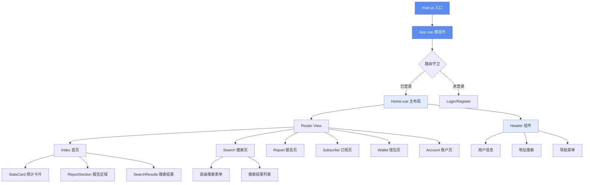
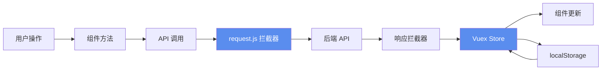
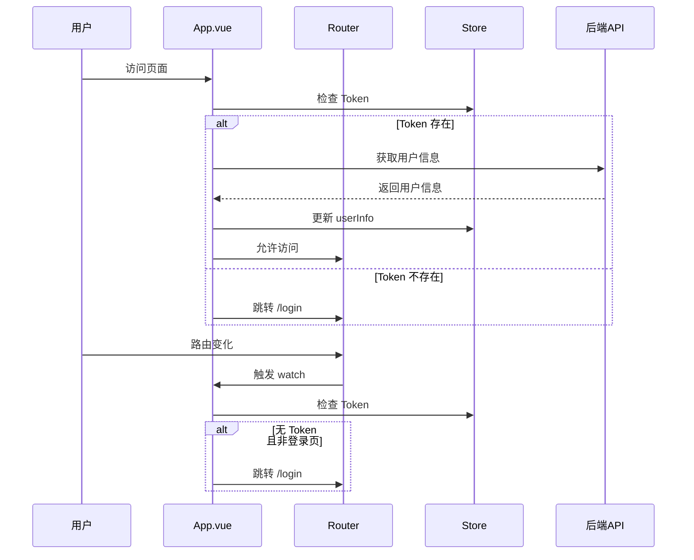

# PlotMaxWebB 项目架构分析

## 📋 项目概述

**PlotMaxWebB** 是一个基于 Vue 2 的房地产数据分析平台（B端应用），主要功能包括：
- 地址搜索和高级搜索
- 房地产报告购买和管理
- 订阅服务管理
- 用户账户和组管理
- 钱包和支付功能

## 🛠 技术栈

### 核心框架
- **Vue 2.6.14** - 前端框架
- **Vue Router 3.5.1** - 路由管理
- **Vuex 3.6.2** - 状态管理
- **Element UI 2.15.14** - UI 组件库

### 工具库
- **Axios 0.18.1** - HTTP 请求库
- **Day.js 1.11.13** - 日期处理库
- **Sass** - CSS 预处理器

### 构建工具
- **Vue CLI 5.0** - 项目脚手架
- **Babel** - JavaScript 编译器

## 📁 项目结构

```
PlotMaxWebB/
├── public/                 # 静态资源
│   ├── index.html
│   └── plotmax-tob-logo.jpg
├── src/
│   ├── apis/              # API 接口定义
│   │   └── index.js
│   ├── assets/            # 静态资源
│   │   ├── css/           # 全局样式
│   │   ├── header/        # 头部图标
│   │   ├── icons/         # 通用图标
│   │   └── logo/          # Logo
│   ├── components/        # 公共组件
│   │   ├── Header.vue     # 顶部导航栏
│   │   ├── EditUserInfo.vue
│   │   ├── ReportSection.vue
│   │   ├── SearchResults.vue
│   │   └── StatsCard.vue
│   ├── router/            # 路由配置
│   │   └── index.js
│   ├── store/             # Vuex 状态管理
│   │   └── index.js
│   ├── utils/             # 工具函数
│   │   ├── request.js     # Axios 封装
│   │   ├── utils.js       # 通用工具函数
│   │   └── enums.js       # 枚举定义
│   ├── views/             # 页面组件
│   │   ├── Home.vue       # 主布局
│   │   ├── login/         # 登录页
│   │   ├── register/      # 注册页
│   │   ├── index/         # 首页
│   │   ├── search/        # 搜索页
│   │   ├── report/        # 报告页
│   │   ├── subscribe/     # 订阅页
│   │   ├── wallet/        # 钱包页
│   │   ├── account/       # 账户页
│   │   ├── chooseService/ # 选择服务页
│   │   ├── result/        # 结果页（支付成功等）
│   │   └── mixins/        # 混入
│   ├── App.vue            # 根组件
│   └── main.js            # 入口文件
├── .env.development       # 开发环境配置
├── .env.production        # 生产环境配置
├── vue.config.js          # Vue CLI 配置
└── package.json
```

## 🏗 核心架构

### 架构流程图



### 数据流向



## 🧩 公共组件详解

### 1. Header.vue - 顶部导航栏
**位置**: `src/components/Header.vue`

**功能**:
- Logo 和品牌展示
- 地址搜索（带自动完成）
- 操作按钮（购买报告、高级搜索）
- 用户信息下拉菜单
- 订阅提醒图标

**关键特性**:
- 使用 `el-autocomplete` 实现地址搜索
- 集成 `MapStateMixins` 获取用户信息
- 路由跳转和状态管理

### 2. EditUserInfo.vue - 编辑用户信息
**位置**: `src/components/EditUserInfo.vue`

**功能**: 编辑当前用户/组的信息

### 3. StatsCard.vue - 统计卡片
**位置**: `src/components/StatsCard.vue`

**功能**: 展示统计数据（可能在首页使用）

### 4. SearchResults.vue - 搜索结果
**位置**: `src/components/SearchResults.vue`

**功能**: 展示搜索结果列表

### 5. ReportSection.vue - 报告区域
**位置**: `src/components/ReportSection.vue`

**功能**: 展示报告相关区域

## 🗺 路由结构

### 路由层级

```mermaid
graph TD
    A[根路由 /] --> B[Home 布局]
    A --> C[/login 登录页]
    A --> D[/register 注册页]
    
    B --> E[/ 首页]
    B --> F[/account 账户页]
    B --> G[/search 搜索页]
    B --> H[/search/result 搜索结果]
    B --> I[/report 报告页]
    B --> J[/subscribe 订阅页]
    B --> K[/wallet 钱包页]
    B --> L[/choose-service 选择服务]
    B --> M[/point-not-enough 点数不足]
    B --> N[/pay-success 支付成功]
    B --> O[/pay-pack-success 打包支付成功]
    B --> P[/subscribe-success 订阅成功]
    
    style B fill:#5A8DEE,color:#fff
    style C fill:#E2ECFF
    style D fill:#E2ECFF
```

### 路由配置特点
- **主布局路由**: 所有业务页面都在 `Home.vue` 下作为子路由
- **认证路由**: `/login` 和 `/register` 独立于主布局，设置 `meta: { noAuth: true }`
- **路由守卫**: 在 `App.vue` 中通过 `watch $route` 实现简单的路由守卫
- **History 模式**: 使用 `history` 模式，需要服务器配置支持

## 💾 状态管理 (Vuex)

### Store 结构

```javascript
state: {
  Authorization: '',      // 认证 Token
  userInfo: null,        // 用户信息
  rememberMe: 'false',   // 记住我
  username: null         // 用户名
}

getters: {
  token,                 // 获取 Token
  userInfo               // 获取用户信息
}

mutations: {
  changeLogin,           // 登录/登出
  refreshUserInfo,       // 刷新用户信息
  setUserInfo,          // 设置用户信息
  setRememberMe,        // 设置记住我
  setUsername           // 设置用户名
}
```

### 数据持久化
- Token 和用户信息存储在 `localStorage`
- 页面刷新时从 `localStorage` 恢复状态

## 🌐 API 管理

### API 结构
**位置**: `src/apis/index.js`

**主要 API 分类**:

1. **认证相关**
   - `login()` - 登录
   - `register()` - 注册
   - `sendCode()` - 发送验证码
   - `userInfo()` - 获取用户信息

2. **用户/组管理**
   - `listGroupUser()` - 获取组成员列表
   - `addGroupUser()` - 添加组成员
   - `deleteGroupUser()` - 删除组成员
   - `editCurrentGroup()` - 编辑组信息
   - `getCurrentGroup()` - 获取组信息

3. **搜索相关**
   - `searchAddress()` - 简单地址搜索
   - `searchCity()` - 城市搜索
   - `searchComplex()` - 高级搜索
   - `searchOrderList()` - 搜索订单列表

4. **报告相关**
   - `getGroupReportList()` - 获取组报告列表
   - `myReportList()` - 我的报告列表
   - `groupReportList()` - 组报告列表
   - `buyReport()` - 购买报告
   - `topReport()` - 置顶报告

5. **订阅相关**
   - `subscribeDetail()` - 获取订阅详情
   - `paySubscribe()` - 支付订阅
   - `unsubscribe()` - 取消订阅
   - `changeSubscribe()` - 修改订阅

6. **支付相关**
   - `payPack()` - 购买额外点数

### 请求拦截器
**位置**: `src/utils/request.js`

**功能**:
- 自动添加 `Authorization` Token
- 统一错误处理
- 401 未授权自动跳转登录页
- 错误消息提示

## 🛠 工具函数

### 1. request.js - HTTP 请求封装
- 基于 Axios 封装
- 请求/响应拦截器
- 统一错误处理

### 2. utils.js - 通用工具函数
**主要功能**:
- `formatterPrice()` - 价格格式化（USD）
- `formatterArea()` - 面积格式化（sqft/acre）
- `formatterAcre()` - 英亩格式化
- `formatSearchParams()` - 搜索参数格式化
- `formatSearchFormParams()` - 搜索表单参数格式化

**选项配置**:
- `lotSizeMinOptions` - 地块大小选项
- `frontageOptions` - 临街宽度选项
- `buildableSizeOptions` - 可建面积选项
- `footPrintOptions` - 占地面积选项
- `grossFloorAreaOptions` - 总建筑面积选项

### 3. enums.js - 枚举定义
- `subscribes` - 订阅计划枚举（包含价格信息）

## 🎨 样式系统

### 全局样式
**位置**: `src/assets/css/common.scss`

**主要内容**:
- Element UI 主题定制（主色：`#5A8DEE`）
- Flex 布局工具类
- Margin/Padding 工具类（1-20px）

### 样式特点
- 使用 SCSS 预处理器
- 工具类优先的样式方案
- 统一的颜色主题

## 🔄 混入 (Mixins)

### MapStateMixins
**位置**: `src/views/mixins/MapStateMixins.js`

**功能**:
- 统一映射 Vuex state 和 mutations
- 提供 `userInfo`、`isLogin`、`rememberMe`、`username` 等计算属性
- 提供 `changeLogin`、`setUserInfo` 等方法

**使用场景**: 需要在多个组件中访问用户信息和状态管理方法

## 📦 环境配置

### 开发环境 (.env.development)
```
BASE_URL = '/'
VUE_APP_BASE_API = '//localhost:8084/apis'
```

### 生产环境 (.env.production)
```
BASE_URL = '/agent'
VUE_APP_BASE_API = '/apis'
```

### 代理配置 (vue.config.js)
- 开发服务器端口: `8084`
- API 代理: `/apis` -> `https://plot-max.com/apis`

## 🔐 认证流程



## 🎯 核心业务流程

### 1. 地址搜索流程
```
用户输入地址 → Header 组件 → searchAddress API → 显示自动完成列表 
→ 选择地址 → 跳转 /choose-service → 购买报告
```

### 2. 高级搜索流程
```
点击高级搜索 → /search 页面 → 填写搜索条件 → searchComplex API 
→ 显示搜索结果 → 购买搜索结果
```

### 3. 订阅流程
```
访问 /subscribe → 选择订阅计划 → paySubscribe API → Stripe 支付 
→ 支付成功回调 → /subscribe-success
```

## 📝 开发建议

### 代码规范
- 遵循 Vue 2 官方风格指南
- 组件命名使用 PascalCase
- 方法命名使用 camelCase
- 使用 SCSS 进行样式编写

### 最佳实践
1. **状态管理**: 使用 Vuex 管理全局状态，避免 props 层层传递
2. **API 调用**: 统一使用 `src/apis/index.js` 中的方法
3. **工具函数**: 通用格式化函数挂载到 Vue 原型上
4. **组件复用**: 公共组件放在 `src/components/`
5. **路由守卫**: 在 `App.vue` 中统一处理认证逻辑

### 注意事项
- 项目使用 Vue 2，注意与 Vue 3 的差异
- Element UI 2.x 版本，升级需谨慎
- Axios 版本较旧（0.18.1），建议升级
- 生产环境 BASE_URL 为 `/agent`，部署时注意路径配置

## 🔍 快速定位

### 修改用户信息相关
- 组件: `src/components/EditUserInfo.vue`
- API: `src/apis/index.js` → `editCurrentGroup()`

### 修改搜索功能
- 简单搜索: `src/components/Header.vue`
- 高级搜索: `src/views/search/index.vue`
- API: `src/apis/index.js` → `searchAddress()`, `searchComplex()`

### 修改订阅功能
- 页面: `src/views/subscribe/index.vue`
- API: `src/apis/index.js` → `subscribeDetail()`, `paySubscribe()`

### 修改样式主题
- 全局样式: `src/assets/css/common.scss`
- Element UI 主题色: 修改 `$--color-primary` 或使用 CSS 覆盖

---

**最后更新**: 2026-01-26
